# Eduson
## Различные файлы для уроков в Eduson:
### DockerForTesting:
#### [Для локального запуска Unit-теста (main.py) и сборки образа из dockerfile](unitTest/):
Проверьте, что docker доступен:  
```
docker
```
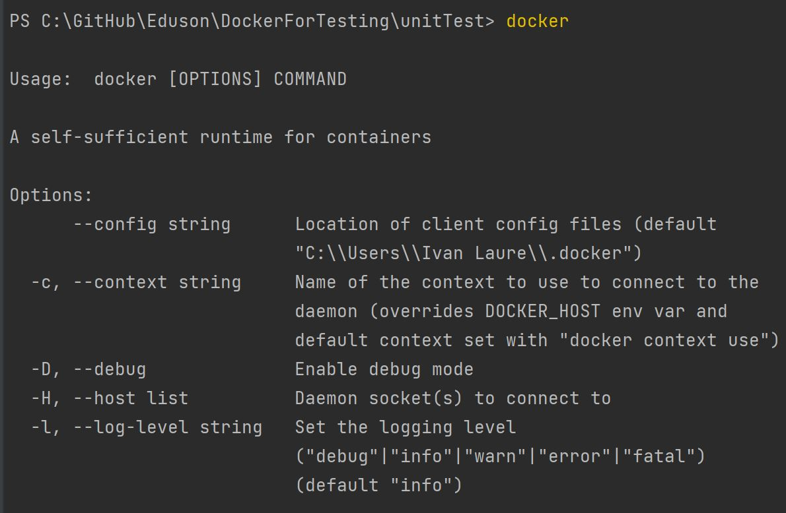  
Если Docker не установлен, нужно поставить [https://www.docker.com/](https://www.docker.com/)  
  
Проверьте, какие образы сейчас есть:  
```
docker images
```
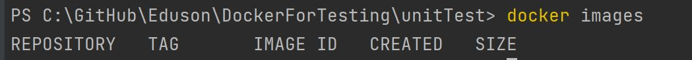  
Находясь в той же директории где dockerfile, чтобы собрать образ (например, с именем "autotestlocal") достаточно выполнить:  
```
docker build -t autotestlocal .
```
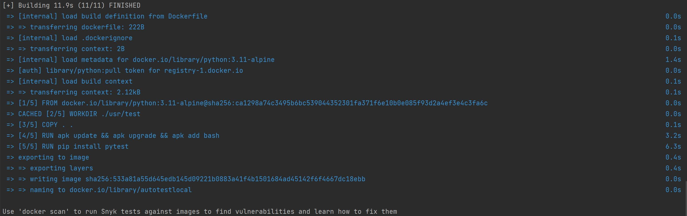  
Для запуска контейнера (например, с именем "autotestlocal_container") с использованием созданного образа достаточно выполнить:  
```
docker run --name autotestlocal_container -it autotestlocal
```
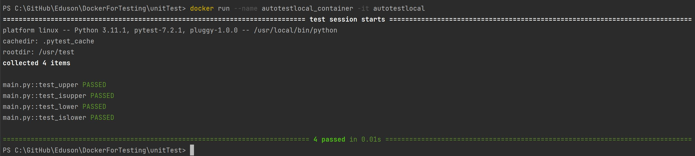  
#### [Для локального запуска OWASP Juice Shop и примера одного теста (test.py) из dockerfile](juiceShopTest/):
Скачайте образ сайта OWASP Juice Shop:  
```
docker pull bkimminich/juice-shop
```
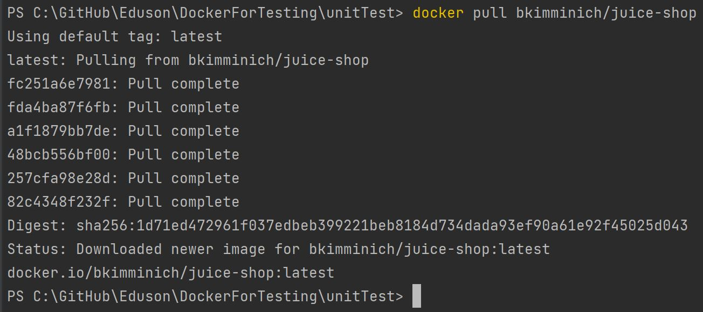  
Создайте сеть testnet:  
```
docker network create testnet
```
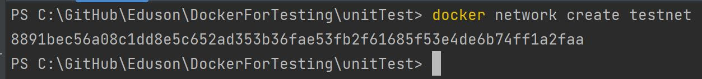  
Запустите контейнер (например, с именем "testweb") с сайтом [juice-shop](https://github.com/juice-shop/juice-shop) образ на [hub.docker.com](https://hub.docker.com/r/bkimminich/juice-shop/) - нужно запускать в отдельном окне и не закрывать до окончания тестирования:  
```
docker run --net testnet --rm -p 3000:3000 --name testweb bkimminich/juice-shop
```
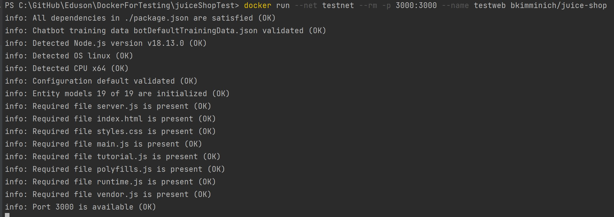  
Находясь в той же директории где [dockerfile для тестов](https://github.com/ilaure/Eduson/blob/main/DockerForTesting/juiceShopTest/dockerfile), собрать образ (например, с именем "autotest_web_container"):  
```
docker build -t autotest_web_container .
```
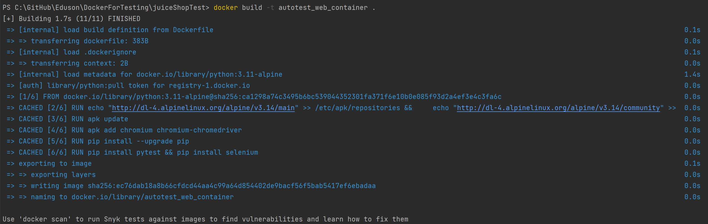  
Находясь в той же директории где test.py, запустим контейнер (ниже используйте для Windows `${PWD}`, для Mac или Linux `$(pwd)`):  
```
docker run -it -v ${PWD}:/user/test/ -w /user/test/ --net testnet autotest_web_container python test.py
```
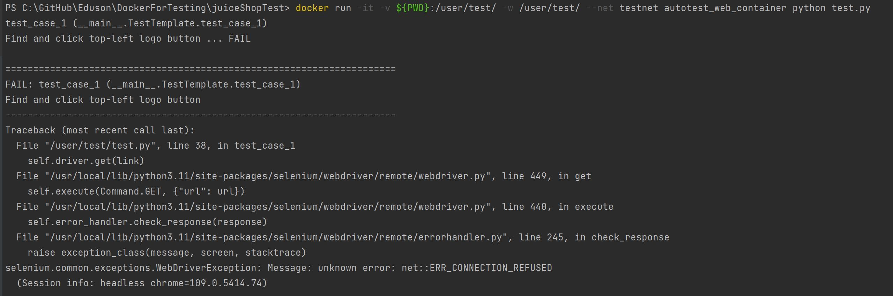  
Чтобы узнать какие docker сети созданы:  
```
docker network ls
```
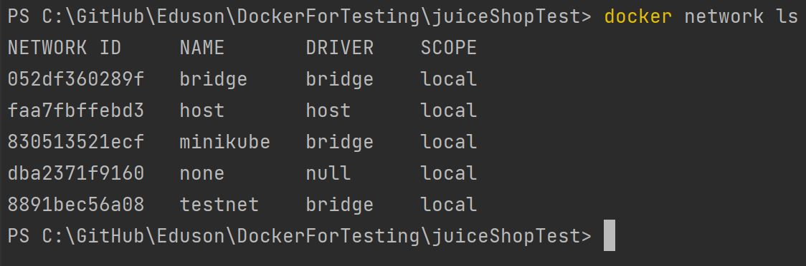  
Чтобы узнать данные по конкретной docker сети (например, "testnet"):  
```
docker network inspect testnet
```
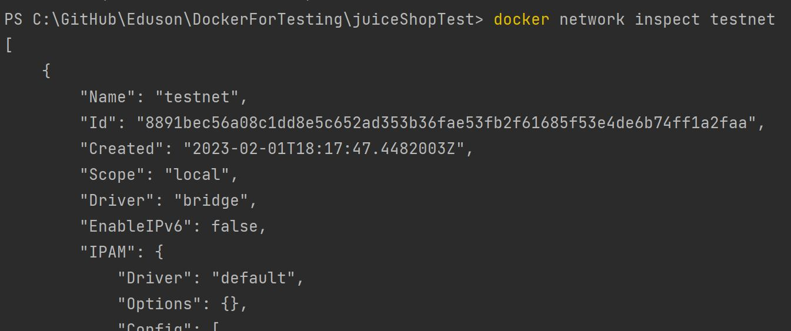  
Чтобы быстро получить IPv4 адрес для контейнера запущенного в нужной docker сети (например, "testnet"):  
```
docker network inspect testnet | find "IPv4Address"
```
Полученный адрес нужно указать [в файле test.py](https://github.com/ilaure/Eduson/blob/main/DockerForTesting/juiceShopTest/test.py) вместо localhost, исходная строчка: 
```
link = "http://localhost:3000/#/"
```
Заменить например на:
```
link = "http://172.19.0.2:3000/#/"
```
И снова находясь в той же директории где test.py, запустим контейнер (ниже используйте для Windows `${PWD}`, для Mac или Linux `$(pwd)`):  
```
docker run -it -v ${PWD}:/user/test/ -w /user/test/ --net testnet autotest_web_container python test.py
```
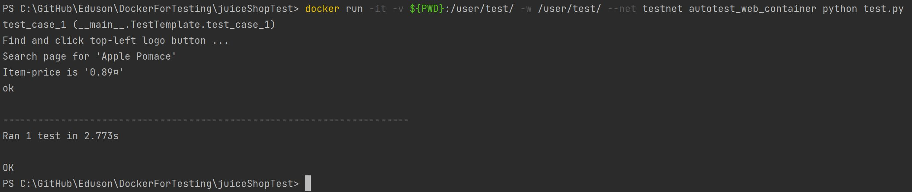  
