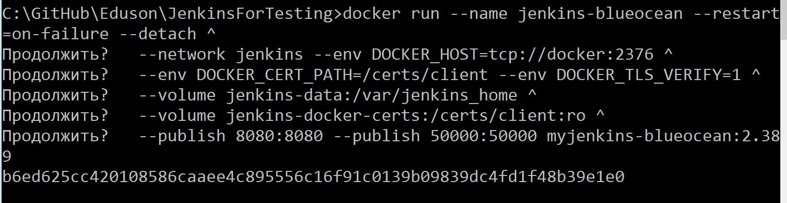

# Eduson
## Различные файлы для уроков в Eduson:
### JenkinsForTesting:
#### Проверьте, что docker доступен:
```
docker
```


Если Docker не установлен, нужно поставить [https://www.docker.com/](https://www.docker.com/)
#### Проверьте, какие образы сейчас есть:
```
docker images
```


#### Создаём сеть в докере которую будем использовать:
```
docker network create jenkins
```


#### Используя Dockerfile из репозитория соберём образ:
```
docker build -t myjenkins-blueocean:2.389 -f DockerfileJenkins .
```


#### Запустить контейнер c Jenkins Blueocean (для Windows):
```
docker run --name jenkins-blueocean --restart=on-failure --detach ^
  --network jenkins --env DOCKER_HOST=tcp://docker:2376 ^
  --env DOCKER_CERT_PATH=/certs/client --env DOCKER_TLS_VERIFY=1 ^
  --volume jenkins-data:/var/jenkins_home ^
  --volume jenkins-docker-certs:/certs/client:ro ^
  --publish 8080:8080 --publish 50000:50000 myjenkins-blueocean:2.389
```


#### Запустить контейнер c Jenkins Blueocean (для macOS and Linux):
```
docker run --name jenkins-blueocean --restart=on-failure --detach \
  --network jenkins --env DOCKER_HOST=tcp://docker:2376 \
  --env DOCKER_CERT_PATH=/certs/client --env DOCKER_TLS_VERIFY=1 \
  --publish 8080:8080 --publish 50000:50000 \
  --volume jenkins-data:/var/jenkins_home \
  --volume jenkins-docker-certs:/certs/client:ro \
  myjenkins-blueocean:2.389
```
#### Чтобы выполнять команды Docker внутри узлов Jenkins, потребуется ещё один образ docker:dind запустим сразу его:
```
docker run --name jenkins-docker --rm --detach ^
  --privileged --network jenkins --network-alias docker ^
  --env DOCKER_TLS_CERTDIR=/certs ^
  --volume jenkins-docker-certs:/certs/client ^
  --volume jenkins-data:/var/jenkins_home ^
  --publish 2376:2376 ^
  docker:dind
```


#### Переходим на http://localhost:8080/ и нам нужно предоставить пароль из /var/jenkins_home/secrets/initialAdminPassword, для этого:
```
docker exec jenkins-blueocean cat /var/jenkins_home/secrets/initialAdminPassword
```


#### Можно открыть bash в Jenkins:
```
docker exec -it jenkins-blueocean bash
```


#### Добавление Jenkins агента по SSH:
Действуем по рекомендации https://www.jenkins.io/doc/book/using/using-agents/  
Генерируем ssh ключи:
```
ssh-keygen -f C:\Eduson\JenkinsForTesting\jenkins_agent_key\id_rsa
```


В UI Jenkins Manage Credentials > Add Credentials > SSH Username with private key
Локально запускаем докер контейнер с ssh-agent:jdk11:  
```
docker run -d --rm --name=agent1 --network jenkins -p 22:22 -e "JENKINS_AGENT_SSH_PUBKEY=[your-public-key]" jenkins/ssh-agent:jdk11
```


В UI Jenkins Manage Credentials > Add Credentials > SSH Username with private key, указываем:  
```
agent1 
/home/jenkins
label ssh
Only build jobs with label expressions matching this node
Launch agents via SSH
```
Чтобы узнать IP agent1:  
```
docker container inspect agent1
```


При добавлении агента не забываем указать:  
```
Host
Credentials
Manually trusted key verification
```
#### Чтобы запустить Jenkins агента внутри Docker, потребуется ещё один образ (https://hub.docker.com/r/alpine/socat/):
```
docker run --name jenkins-socat -d --restart=always -p 4444:2375 ^
  --network jenkins ^
  -v /var/run/docker.sock:/var/run/docker.sock ^
  alpine/socat ^
  tcp-listen:4444,fork,reuseaddr ^
  unix-connect:/var/run/docker.sock
```


Затем найдём IP адрес данного контейнера:
```
docker inspect jenkins-socat
```


Затем в UI Dashboard > Manage Jenkins > Configure Clouds > Docker Cloud details:  
```
tcp://<IP>:4444
Enabled
Test Connection
```
Docker Agent templates:  
Label and Name docker
Docker Image jenkins/agent:alpine-jdk11
Instance Capacity 1
Only build jobs with label expressions matching this node

#### Запустим проект тестирования сайта juice-shop:
Запустим в докере:  
```
docker run --net jenkins --rm -p 3000:3000 --name testweb bkimminich/juice-shop
```


Определим IP сайта:  
```
docker inspect testweb
```

